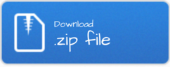

# Curso-Ecofemidata

__Clase 1 - Introducción a los datos con perspectiva feminista__

__Clase 2 - Introducción a R base__

__Clase 3 - Introducción a tidyverse__

__Clase 4 - Tidyverse__

__Clase 5 - Visualización__

__Clase 6 - Visualización de gráficos e iteraciones__

__Clase 7 - Clase de cierre__

 + ENGHo y EANNA
 + ¿Cómo seguir?

