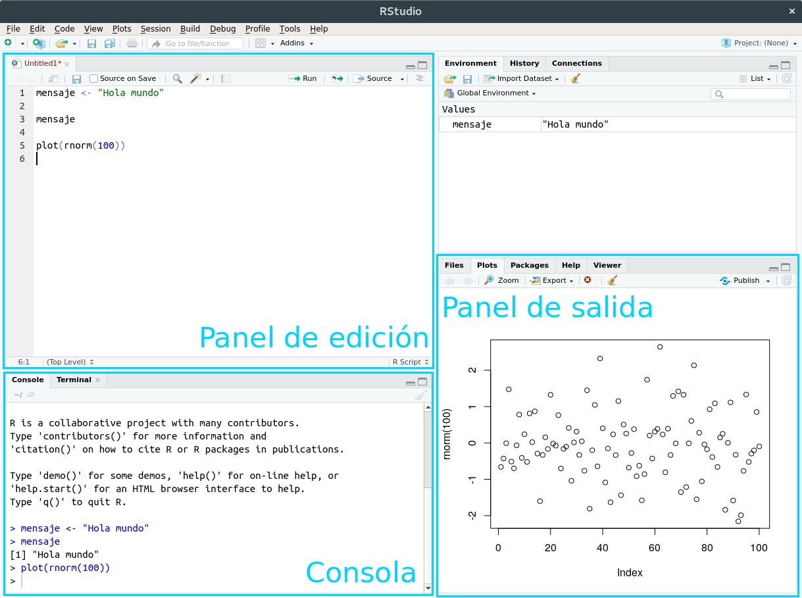

```{r setup, include=FALSE}
knitr::opts_chunk$set(echo=FALSE)
```

```{r message=FALSE, warning=FALSE, include=FALSE, paged.print=FALSE}
knitr::opts_chunk$set(echo=TRUE, message=FALSE, warning=FALSE, collapse=TRUE, highlight=TRUE, paged.print=FALSE, prompt=TRUE, strip.white=FALSE, tidy = TRUE)
```

## Intro

### ¿Qué es R?

-   Lenguaje de programación → **análisis** y **visualización** de datos
-   Código abierto → esto significa que su instalación y uso sean **GRATIS**
-   Comunidad abierta y colaborativa → hay un conjunto de **funciones básicas** al cual se le van agregando diferentes **paquetes** con funcionalidades específicas
-   Paquetes instalables → siempre hay nuevas **funcionalidades "customizables"** para lo que queremos hacer. Los paquetes que veremos en este curso, `tidyverse` y `ggplot` son dos ejemplos de estos paquetes.

## Pantalla de trabajo



-   El trabajo en R se hace desde el **panel de edición**, aunque también puedo escribir código desde la **consola**. Sin embargo, aquí no quedará guardado.

-   Los resultados aparecen en la **consola**.

-   En el **panel de salida** van a aparecer los gráficos, las pestañas de archivos y la ayuda.

-   Para modificar cómo se ve el entorno de ejecución (cambiar los colores, poner en "modo oscuro") tengo que ir a **Tools -\> Global options -\> Appearance**.

-   Para crear un script nuevo desde el cual trabajar, hago clic en **File -\> New File -\> R Script.**

-   Para correr una línea de código, doy **Control + Enter**.

-   Los objetos que generamos en R **no se guardan automáticamente en la computadora**. Tenemos que usar funciones específicas según el formato (si exportamos un dataframe, una imagen, un gif, etc).

### Ayuda en R

El comando básico para averiguar qué hace una función o simplemente pedir ayuda es `help("nombre de la función")` o `?("nombre de la función")`.

### Mensajes de error

Cuando tipeamos mal algo, cuando intentamos usar una función en un objeto que no corresponde, o, en general, nos la mandamos, R va a imprimir un **mensaje de error** en la consola. Esto no es lo mismo que un **warning**, que nos aparece también en la consola en el mismo color. Este último es nada más una advertencia de que el comando que emitimos operó de una determinada manera que quizás no nos guste, pero en general no significa que algo haya salido mal.

Cuando hay un mensaje de error, lo que queríamos hacer no salió. Esto es lo más normal del mundo, por lo que, además de frustrarnos y entrar en pánico, como regla general lo que hay que hacer es pegar ese mensaje de error en Google y ver los primeros resultados. 99.9% de las veces alguien más ya tuvo ese error y lo subió a Stack Overflow o alguna otra plataforma de respuestas, y allí vamos a encontrar la forma de solucionar el problema.

## Objetos de R base

Los **Objetos/Elementos** constituyen la categoría esencial de R. De hecho, todo en R es un objeto, y se almacena con un nombre específico que **no debe poseer espacios**. Un número, un vector, una función, la progresión de letras del abecedario, una base de datos, un gráfico, constituyen para R objetos de distinto tipo. Los objetos que vamos creando a medida que trabajamos pueden visualizarse en la panel derecho superior de la pantalla ("Environment").

Los nombres de los objetos deben empezar con una letra y únicamente pueden contener letras, números, \_ y .. Por convención, se recomienda hacer nombres descriptivos y utilizar el guión bajo como espacio (por ejemplo, si quiero crear una columna de nombres y apellidos la puedo nombrar nombre_apellido).

### Valores

La unidad mínima que pueden contener estos objetos son los *valores*. Existen cuatro tipos:

-   `character`: valores alfanuméricos, es decir, letras, números y signos mezclados.

-   `numeric`: valores numéricos, incluye decimales.

-   `integer`: números enteros, no incluye decimales.

-   `logical`: valores lógicos, un TRUE o FALSE

Para guardar un objeto en R se usa el símbolo = o una flecha \<-. Por convención, se usa la flecha. A la izquierda siempre va el nombre que le vamos a asignar al objeto, y a la derecha, el valor. .

```{r}
objeto_1 <- 55
objeto_2 = 7
```

Al definir un elemento, el mismo queda guardado en el ambiente del programa, y podrá ser utilizado posteriormente para observar su contenido o para realizar una operación con el mismo.

Si quiero ver el contenido de un objeto, puedo imprimirlo en el script llamando al nombre del objeto:

```{r}
objeto_1
```

Los objetos pueden sobreescribirse. Esto quiere decir que si vuelvo a generar un objeto con el mismo nombre que tiene otro ya existente, el último reemplaza al primero.

¡Ojo! No es lo mismo imprimir el objeto en la consola que *generarlo*. Si yo nada más hago:

```{r}
"Ejemplo"
```

El valor no quedará almacenado en ningún lado. Siempre que quiero guardar un objeto tengo que usar la flecha invertida `<-`.

### Vectores

R puede almacenar un conjunto de valores como un mismo objeto en un elemento llamado **vector**.

```{r, echo=TRUE, message=FALSE, warning=FALSE, collapse=TRUE, highlight=TRUE, paged.print=FALSE, prompt=TRUE, strip.white=FALSE}
vector_1 <- c(55, 65, 75, 85, 95, 105) #Este sería un vector numérico
vector_2 <- c("Uno", "Dos", "Tres", "Cuatro", "Cinco") #Y este un vector de texto
```

Cuando se mezclan diferentes objetos en un vector R hace uso de la "coerción": se fuerza a los objetos a transformarse en una misma clase

```{r, highlight=TRUE, prompt=TRUE, strip.white=FALSE, collapse=TRUE, }
y<-c(1.2,"a") 
y
x<-c(FALSE, 2)
x
```

Puede aplicarse de forma explícita la coercion; se usan las funciones `as.[class]`. Esta coercion puede aplicarse a otros objetos, no solo a vectores

```{r, echo=TRUE, message=FALSE, warning=FALSE, collapse=TRUE, highlight=TRUE, paged.print=FALSE, prompt=TRUE, strip.white=FALSE}
x<-0:6 #Este es un comando que devuelve un rango de valores
as.character(x)
```

### Factores

Para almacenar valores categóricos se usa el objeto factor. Funcionan como un integrer con una etiqueta asociada. Se puede generar factors ordenados con el argumento `levels`. Por default, R usa el orden numérico ascendente u orden alfabético dependiendo el tipo de valor.

```{r, highlight=TRUE, prompt=TRUE, strip.white=FALSE, collapse=TRUE,   echo=TRUE}
nivel_ed<- factor(c("Primario completo","Universitario/Terciario incompleto","Posgrado completo","Secundario incompleto","Secundario incompleto"))
nivel_ed

nivel_ed <- factor(c("Primario completo", "Universitario/Terciario incompleto", "Posgrado completo", "Secundario incompleto", "Secundario incompleto"),
            levels=c("Primario incompleto","Primario completo", "Secundario incompleto", "Secundario completo", "Universitario/Terciario incompleto", "Universitario/Terciario completo", "Posgrado incompleto", "Posgrado completo¨"))
nivel_ed
```

### Listas

Las listas son una clase especial de vector: pueden contener elementos de cualquier tipo en su interior.

```{r, highlight=TRUE, prompt=TRUE, strip.white=FALSE, collapse=TRUE,   echo=TRUE}
mi_lista<-list(1,"a",TRUE, 4.6)
mi_lista
```

Por ejemplo, puedo llenar una lista de vectores:

```{r}
mi_lista <- list(c("A", "B", "C", "D"), c(1:15))
mi_lista
```

### Dataframes

Finalmente, están los dataframes. Son lo más parecido a lo que entendemos por base de datos. Cada columna es una variable, y cada fila es una observación. Para R son un tipo especial de vector, en la cual cada elemento del vector tiene la misma longitud (`length()`). Cada observación (fila) está compuesta por datos que pueden ser de distinto tipo.

Este objeto es central en el proceso de trabajo, ya que es la estructura más usada para realizar análisis de datos, y suele ser la forma en que se cargan datos externos para trabajar en el ambiente de R, y en que se exportan los resultados de nuestros trabajo.

-   Tienen un atributo especial: `row.names`, que vendría a ser como el identificador de cada fila.

-   Pueden ser transformados en matrices usando `data.matrix()`

La función básica para crear un dataframe a partir de dos vectores es `data.frame()`. Creemos uno a partir de tres vectores:

```{r, highlight=TRUE, prompt=TRUE, strip.white=FALSE, collapse=TRUE, echo=TRUE}
### Creo los vectores 
nombres <- c("Carolina Pradier", "Laia Domenech Burin", "Natsumi Shokida", "Justina Lee")
edades <- c(24, 23, 29, 29)

#Creamos el dataframe y lo guardamos en el objeto "data"
data <- data.frame(nombres, edades)

data
```

Algunas funciones útiles para trabajar con dataframes son:

-   `dim()`: indica la cantidad de filas y columnas del dataframe.

```{r}
dim(data)
```

-   `str()`: muestra la **estructura** del dataframe. Los nombres de las columnas, la cantidad de observaciones, y las primeras observaciones de cada columna.

```{r}
str(data)
```

-   `summary()`: da un resumen en forma de estadísticas descriptivas para las variables numéricas (cuartiles y mediana) y un vistazo a las categorías más representadas par los factores

```{r}
summary(data)
```

-   `head()`: nos muestra por default las primeras 10 observaciones de la base. Puedo modificar la cantidad de filas que quiero ver cambiando el argumento `n`.

```{r}
head(data)

head(data, n = 20)
```

-   `names()`: nos muestra los nombres de las columnas del dataframe.

```{r}
names(data)
```

### Valores nulos

Los NA's o valores nulos son, justamente, valores que no existen o aparecen. Estos pueden resultar algo problemáticos a la hora de trabajar, por lo que es importante identificarlos y decidir qué hacer con ellos. La función `is.na()`nos devuelve un vector logical indicando qué valores son NA.

```{r}
na_ejemplo <- c(1,2,NA,4,NA)
is.na(na_ejemplo)
```

## Operaciones con los objetos

Puedo hacer múltiples operaciones con los objetos a través de [operadores](https://www.datamentor.io/r-programming/operator/#arithmetic_operators). Estos pueden ser **arimétricos**, por ejemplo:

```{r, echo=TRUE, message=FALSE, warning=FALSE, collapse=TRUE, highlight=TRUE, paged.print=FALSE, prompt=TRUE, strip.white=FALSE}
objeto_3 <- 10
objeto_4 <- 5

objeto_3/5
objeto_3+objeto_4
```

Los operadores también pueden aplicarse sobre vectores de la misma forma:

```{r}
n <- 1:10
n+5
```

**Pero** no sobre listas, ya que un operador arimétrico sólo se puede aplicar en un subconjunto numérico.

Los operadores también pueden pueden ser **relacionales**, para hacer comparaciones entre valores. Éstos son:

-   `<` o `>`, para indicar si es menor a o mayor a y `<=` o `>=` para indicar si es mayor o igual/menor o igual.

```{r}
objeto_3 < objeto_4

objeto_3 > objeto_4
```

-   `==` para indicar si un valor es igual a otro y `!=` para indicar si un valor **no** es igual a otro.

```{r}
"Ocupado" != "Desocupado"

"Ocupado" == "Desocupado"
```

-   `!` como negación.

```{r}
!is.na("A")

!is.na(NA)
```

O **lógicos**, los cuales son para hacer expresiones booleanas. Esto quiere decir que se usan para hacer combinaciones y búsquedas más complejas. Los principales son `&` para hacer búsquedas de AND, o `|` para hacer búsquedas OR.

## Navegando por los objetos

Ahora bien, ¿de qué sirve almacenar los valores en objetos como vectores, listas o dataframes? ¿Cómo podemos acceder a estos valores? ¿Cómo podemos aplicar transformaciones a un subconjunto de estos objetos? A estas operaciones se las llama *subsetting* o *slicing*.

La forma para navegar a través de los valores de un vector, una lista o un dataframe es a través de corchetes (`[]`).

Por ejemplo, supongamos que queremos tomar el segundo valor del vector `nivel_ed` con el que veníamos trabajando:

```{r}
nivel_ed[2]
```

También podemos usar los corchetes para *modificar* el valor en el vector:

```{r}
nivel_ed[2] <- "Universitario/Terciario completo"

nivel_ed
```

En el caso de una lista, tenemos que usar un doble corchete `[[]]` para acceder a sus valores. Por ejemplo:

```{r}
mi_lista[[1]]
```

Y podemos acceder al valor que queremos dentro de ese nivel de la lista con un corchete simple.

```{r}
mi_lista[[1]][2]
```

En un dataframe, también podemos seleccionar un valor entre corchetes usando el orden `[fila, columna]`. Volvamos a nuestro ejemplo `data`:

```{r}
data
data[4, 1] #Extraemos el nombre del cuarto registro
```

También podemos seleccionar varios valores de una columna con el comando `:`:

```{r}
data[2:4, 1]
```

Y podemos consultarle a R los valores completos de una columna con el comando `$`:

```{r}
data$edades
```

Acorde a lo visto anteriormente, el acceso a los **dataframes** mediante `[ ]` puede utilizarse también para realizar filtros con operadores. Por ejemplo, puedo utilizar los `[ ]` para obtener del **dataframe** los registros de personas mayores de 25:

```{r}
data[data$edad > "25", ]
```

La lógica del paso anterior sería: Accedo al dataframe `data`, pidiendo únicamente conservar las filas (por eso la condición se ubica a la *izquierda* de la `,`) que cumplan el requisito de ser mayores de 25 en la variable **edad**. También puedo poner más de dos condiciones:

```{r}
data[data$edad > "25" & data$nombre == "Natsumi Shokida", ]
```


## Funciones

Hasta ahora, estuvimos trabajando con funciones predeterminadas de R. `dim()`, `str()`, `summary()`, `head()`... son algunas de ellas. La función es una forma de encapsular una serie de operaciones que de otra manera nos llevarían más pasos y tiempo. Una función tiene un nombre y coloca entre paréntesis () los argumentos. Por ejemplo, `dim()` contiene un único argumento dentro de los paréntesis, que es el dataframe que queremos inspeccionar.

### Crear funciones

Una de las principales ventajas de R es que, además de usar las funciones que vienen en el programa o en distintos paquetes, podemos *crear* nuestras propias funciones para automatizar etapas de nuestro trabajo que sabemos que vamos a repetir varias vecees. Por ejemplo, si tenemos que hacer muchas veces el mismo procesamiento de una base.

La sintaxis básica para crear una función es la siguiente:

```{r}
fun<-function(argumentos){
	#[se hace algún cómputo]
}
```

-   Primero, la almacenamos como un objeto para poder utilizarla en el entorno.
-   Las funciones tienen un input (argumentos) y devuelven un output (valor):
    -   Argumentos formales: los que están incluidos en la definición de la función

    -   La función `formal()` devuelve los argumentos formales de una función

    -   No todas las funciones en R usan argumentos formales

    -   Los argumentos pueden estar "missing" o tener valores asignados por defecto

    -   Para que una función devuelva un valor, debo almacenarlo en la misma e indicarlo con el comando `return()`

Por ejemplo, si quiero crear una función que multiplique por 10 cualquier vector, hago lo siguiente:

```{r}
funcion_multiplico <- function(vector){
        resultado <- vector*10
        return(resultado)
}

funcion_multiplico(1:10)
```

Algunas funciones tienen **parámetros**, los cuales sirven para especificar una operación que realiza la función. Por ejemplo, la función `paste` que viene en R base sirve para concatenar valores de texto con un separador. El argumento `sep` funciona como parámetro:

```{r}
paste("Estoy", "haciendo", "un", "ejemplo", sep="-")
```

### Funciones útiles

Ya que estamos, podemos ver un popurrí de funciones de R base que resultan bastante útiles:

-   `mean()`: calcula la media arimétrica de un vector.

-   `median()`: devuelve la mediana de un vector.

-   `quantile()`: calcula los casos equivalentes a diferentes proporciones de la distribución en un vector. Con el argumento `prob` se indica en formato vector los cuantiles a calcular. Por ejemplo, si quisiese calcular los rangos intercuartiles indicaría: `prob = c(0.25, 0.5, 0.75)`.

-   `table()`: devuelve una tabla de frecuencias de un vector de texto o factor.

- `prop.table()`: devuelve una tabla de frecuencias relativas en proporción. Para obtener los porcentajes, hago: `prop.table(vector)*100`

- `sum()`: realiza la suma de todos los valores de un vector.

- `round()`: hace un redondeo de los valores. Con el argumento `digits` defino qué cantidad de decimales dejo.

### Borrar objetos

Finalmente, para borrar los objetos de R podemos usar la función `rm()`:

```{r}
rm(data)
```

Si quiero borrar múltiples elementos a la vez, tengo que encapsularlos en una lista dentro de la función:

```{r}
rm(objeto_1, l)
```

¡Terminamos! Ahora, vamos a la parte práctica.
