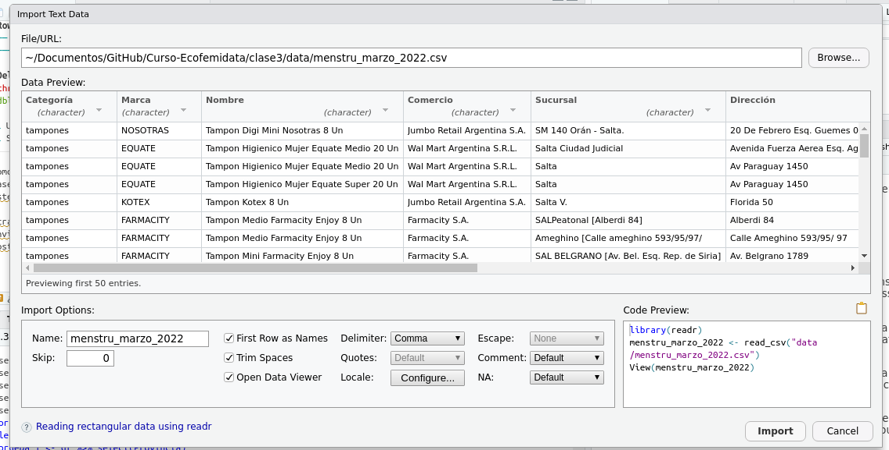

```{r setup, include=FALSE}
knitr::opts_chunk$set(echo=FALSE)
```

```{r message=FALSE, warning=FALSE, include=FALSE, paged.print=FALSE}
knitr::opts_chunk$set(echo=TRUE, message=FALSE, warning=FALSE, tidy=TRUE)
```

## El mundo tidyverse

-   La clase pasada cerramos la parte práctica instalando el paquete **Tidyverse**. Sin embargo, al hacerlo no estaban instalando solo un paquete, sino una colección de paquetes de R que están diseñados para el análisis de datos.
-   La lógica de tener estos paquetes juntos es que todos ellos comparten la misma filosofía, gramática, y estructuras de datos.

{width="50%"}

-   Los principales paquetes que están en este mundo son
    -   `magrittr`: que introduce la **pipe** (%\>%)
    -   `readr`: para la lectura de bases de datos
    -   `dplyr`: orientado a la maniplulación de bases de datos
    -   `tidyr`: para la limpieza de datos
    -   `purr`: provee herramientas para trabajar con funciones sobre vectores
    -   `stringr`: orientado a facilitar el trabajo con datos de texto
    -   `forcats`: orientado a facilitar el trabajo con factores

### ¿Por qué tidyverse?

-   Está diseñado para ser leído y usado de manera simple por seres humanos. La gramática es intuitiva y la mayoría de sus funcionalidades son fáciles de usar.
-   Sus funciones no están pensadas para una tarea específica, sino para todo un flujo de trabajo: desde la importación de datos hasta la comunicación de resultados.
-   Su comunidad está basada en los principios de código abierto y colaborativo. Los mismos diseñadores de los paquetes tienen [muchísimas fuentes](https://www.tidyverse.org/learn/) para aprender a usarlos, y disponen del código abierto de cada paquete en GitHub.

Para empezar a trabajar con el paquete, tenemos que introducirlo en la sesión con la función `library()`:

```{r, echo=TRUE, warning=TRUE}
library(tidyverse)
```

En esta clase vamos a trabajar con la base de datos que usamos como insumo para el informe ["¿Cuánto cuesta menstruar?"](https://ecofeminita.com/cuanto-cuesta-menstruar-marzo22/). Vamos a importar esta base con ayuda del paquete `readr`, el cual tiene tres funciones principales para importar bases en distintos formatos de texto:

-   `read_csv` : para importar archivos de texto separados por comas,
-   `read_tsv()` : para importar archivos de texto separados por tabs (`\t`),
-   `read_delim()` : con el cual podemos definir un separador específico.

Como nuestro archivo está en formato `csv`, vamos a usar la primera función. Llamemos al archivo desde la carpeta `data`:

```{r}
df <- read_csv('./data/menstru_marzo_2022.csv')
```

Como podrán ver, es una sintaxis simple. Simplemente indico la ruta donde está guardado el archivo y se lee la base. Por default, R pone la ruta de trabajo en la carpeta donde está guardado el documento que se abrió (en este caso, `clase3`). Si queremos subir de carpeta, usamos dos puntos: `..`.

Otra manera "manual" de importar bases de datos es con el botón de **Import Dataset** en la pantalla del Enviroment. Desde ahí puedo seleccionar el formato de la base que quiero importar, la ruta, y R me va a mostrar el código que tendría que usar para importarlo:

{width="80%"}

Démosle un vistazo a la estructura de esta base:

```{r}
#Nombre de las columnas
colnames(df)
```

```{r}
#Cantidad de filas
nrow(df)
```

Esto quiere decir que tenemos 31.353 registros sobre precios de toallitas y tampones en el mes de marzo de 2022.

## Pipes: la gramática básica de tidyverse

Más arriba mencionamos que el paquete `magrittr` introduce la pipe y la señalamos como este símbolo `%>%`. La pipe es una **forma de escribir** del mundo tidyverse, que indica que vamos a realizar de terminada operación sobre el objeto que está a la izquierda. Sirve para indicar una secuencia de acciones. La podemos generar con el shortcut **Control + Shift + M**.

Por ejemplo, para sacar la tabla de frecuencias de casos por provincia haríamos lo siguiente:

```{r}
table(df$Provincia)
```

Ahora, con una pipe...

```{r}
df$Provincia %>%
 table()
```

Las funciones pueden concatenarse:

```{r}
df$Provincia%>%
        table()%>%
        prop.table()*100
```

Aquí, expresamos la composición por provincias en términos de proporciones en lugar de cantidad de productos, y al multiplicar por 100 podemos ver estos resultados en puntos porcentuales. Podemos ver así que el 32% de las observaciones son de Buenos Aires

## dplyr

Vimos que este paquete de tidyverse está orientado al manejo de bases de datos. Tiene 5 funciones básicas que resuelven el 90% de nuestros problemas a la hora de limpiar y procesas bases:

1.  `select()`: que selecciona y descarta variables
2.  `filter()`: selecciona y descarta según filas
3.  `mutate()`: crea o edita variables
4.  `rename()`: renombra variables
5.  `summarise()`: colapsa los valores a un solo resumen

Todas pueden ser usadas en conjunto con `group_by()` que cambia el objeto de cada función: en lugar de operar sobre todo el dataset, lo hace al interior de cada grupo definido.

### select()

-   Esta función únicamente requiere poner el nombre de las columnas que elegimos. Podemos elegir según nombre o posición.
-   La forma básica de esta función es `select(nombre_de_la_columna)`.

```{r}
select_prueba_1 <- df %>% select(Provincia)
head(select_prueba_1)
```

-   Puedo seleccionar más de una columna con la coma:

```{r}
select_prueba_2 <- df %>% select(Provincia, Categoría, Marca)

head(select_prueba_2)
```

-   También se puede seleccionar un intervalo de columnas, usando el `:`

```{r}
select_prueba_3 <- df %>% select(Provincia, Categoría, Marca, Region:precio_unidad)

head(select_prueba_3)
```

-   Podemos hacer una selección por **posición de la columna**:

```{r}
select_prueba_4 <- df %>% select(1:5)

head(select_prueba_4)
```

-   Se puede hacer una anti-selección (o sea, elegir todas las columnas menos algunas especificadas)

```{r}
select_prueba_5 <- df %>% select(-c(Sucursal, Dirección, Localidad, Nombre))

head(select_prueba_5)
```

Recuerden que estamos usando `c()` para armar un vector de las variables que vamos a exlcuir.

-   También, se pueden seleccionar columnas según criterios con funciones auxiliares:
    -   `starts_with` : selecciona columnas que empiecen con el string que pasemos.
    -   `ends_with` : selecciona columnas que terminen con el string que le pasemos.
    -   `contains` : selecciona columnas que contengan la palabra que indicamos.

```{r}
select_prueba_6 <- df %>% select(contains("unidad"))

head(select_prueba_6)
```

Por último, puedo renombrar la columna dentro de la selección indicando `select(nombre_nuevo = nombre_viejo)`

```{r}
select_prueba_7 <- df %>% select(prov = Provincia)
head(select_prueba_7)
```

### filter()

-   Es una manera de filtrar filas. Esta función es a las filas lo que select a la columnas.
-   Esta función tiene el siguiente esquema: `filter(CONDICIÓN)`.  
-   La clase 1 vimos los distintos operadores (lógicos, arimétricos, relacionales) que podemos usar para escribir estos formatos condicionales. Refrescando brevemente lo que vimos las primeras clases, recuerden que usamos `|` para indicar un OR inclusivo, `&` para indicar un AND donde se cumplen dos condiciones, y podemos usar `%in%` para chequear que un valor aparezca en un vector. 

Supongamos que queremos quedarnos con los registros de tampones:

```{r}
base_filtrada_1 <- df %>% filter(Categoría == "tampones")

table(df$Categoría)
table(base_filtrada_1$Categoría)
```

Los condicionales también pueden combinarse. Podríamos traer todos los registros de las regiones NEA y NOA:

```{r}
base_filtrada_3 <- df %>% filter(Region == "NOA" | Region == "NEA")

table(df$Region)
table(base_filtrada_3$Region)
```

También podemos combinar los operadores lógicos para hacer un filtrado por condiciones múltiples. Por ejemplo, si quisiéramos todos los registros de toallitas en el NOA y el NEA, hacemos lo siguiente:

```{r}
base_filtrada_4 <- df  %>% filter(Region %in% c("NOA", "NEA") & Categoría == "tampones")

table(base_filtrada_4$Region, base_filtrada_4$Categoría)
```

El filtrado también puede aplicarse sobre columnas para quedarnos sólo con las filas que tienen valores -es decir, borrar los NA.

Vamos a borrar los casos que tienen NA en la categoría `Comercio`. Probemos que pasa si usamos el operador `!=`

```{r}
base_filtrada_5 <- df  %>% filter(Comercio != NA) 
nrow(base_filtrada_5)
```

¡Nos borró todas las variables! Pero esto no está bien, ya que vimos que esta columna tenía varios valores. ¿Qué sucedió?

Resulta que los NA son bastante tramposos en R. Casi cualquier operación con uno de ellos va a devolver otro NA, y es por esto que no debemos trabajar con operadores a la hora de filtrarlos, sino que debemos usar la función `is.na()`

```{r}
base_filtrada_5 <- df  %>% filter(!is.na(Comercio))
nrow(base_filtrada_5)
```

### rename()

-   Esta función solo requiere indicar `NOMBRE_NUEVO = NOMBRE_VIEJO`

```{r}
data_rename <- df %>% rename(precio_lista = Precio.de.lista) %>% select(Categoría, precio_lista, unidades, precio_unidad)

head(data_rename)
```

### mutate()

-   Esta función nos permite crear y modificar columnas.
-   Su sintaxis es `mutate(nombre_de_la_columna = valores_de_la_columna)`

Por ejemplo, podemos crear una columna con la diferencia que tiene cada producto con el promedio de precios de los productos, para ver qué tanto de aleja cada observación de la media. 

Como no queremos mezclar los precios de toallitas y tampones y (por ahora) no vimos cómo hacer operaciones sobre grupos, vamos a usar la `base_filtrada_1` que tenía nada más los precios de tampones.

```{r}
base_filtrada_1 <- base_filtrada_1 %>% mutate(diferencia_precios = precio_unidad-mean(precio_unidad)) 

summary(base_filtrada_1$diferencia_precios)
```

-   Es una función muy útil a la hora de hacer nuevos grupos de variables, sobre todo cuando la usamos con la función `case_when()`. Esta última nos sirve para explicitar valores a partir de condiciones lógicas, es decir, definir qué valores tiene que tomar la variable que creamos o modificamos, según ciertas características de cada observación.

```{r, eval = FALSE}
case_when(
  CONDICION_LOGICA1 ~ operacion o valor1,
  ….,
  CONDICION_LOGICAn ~ operacion o valorn, 
  TRUE ~ operacion o valor
  )
```

Con `TRUE ~ operacion o valor` indico qué sucede con los valores que no cumplen ninguna de las condiciones. Si no lo indico, esas filas adoptarán el valor NA por default.

Supongamos que queremos agrupar los productos en dos grandes grupos: si su precio está por debajo de la media o por arriba de la media.

```{r}
base_filtrada_1 <- base_filtrada_1 %>% mutate(
        grupo_precios = case_when(
          diferencia_precios < 0 ~ "Debajo de la media",
          diferencia_precios > 0 ~ "Encima de la media",
          diferencia_precios == 0 ~ "Igual a la media"
          )
        )

table(base_filtrada_1$grupo_precios)

```

¡Con eso terminamos por hoy! La próxima clase vamos a ver los mencionados `group_by()` y `summarize()`.

Ya pueden pasar a la parte práctica.
