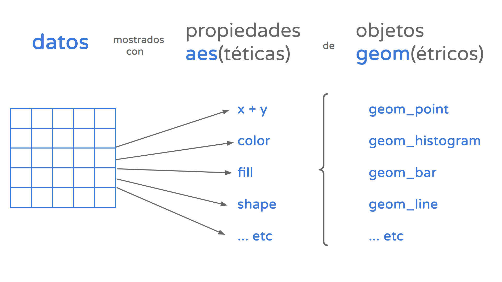

```{r setup, message=FALSE, warning=FALSE, include=FALSE, paged.print=FALSE}
knitr::opts_chunk$set(echo=TRUE, message=FALSE, warning=FALSE, tidy=TRUE)
```

## Mirando datos

Cuando estamos haciendo un gráfico, hacemos que nuestros datos sean comprensibles visualmente de manera rápida. La visualización de datos es un trabajo esencial, y en general nos puede dar respuestas simples a las preguntas de nuestros problemas de investigación. 

En esta clase vamos a ver una aproximación a los principios básicos de la visualización de datos y cómo plasmarlos con la librería `ggplot.` Esta está incluído en la librería `tidyverse`, por lo que no hace falta que la vuelvan a descargar.

Hay dos cuestiones centrales de `ggplot` para saber: 

- Incluye funciones para realizar una gran variedad de visualizaciones. 
- Su concepto central es la asignación (*mapping* en inglés) de atributos estéticos a los valores que toma una variable. Dicho de otra forma, permite mostrar de modo perceptible a la vista la diferencia entre valores: con distintos colores, distintos tamaños, distintas posiciones en un gráfico, etc.
- Las distintas modificaciones que le hacemos al gráfico se agregan como *capas*, de una manera similar a como hacíamos con las pipes en tidyverse. 

## Visualización con `ggplot`

Vamos a ello. En primer lugar, vamos a hacer lo que ya sabemos. Importamos la librería `tidyverse`, luego las liberías `stats` y `spatstat` para funciones adicionales y la librería `eph` que va a contener la base de datos del primer trimestre de 2019 de la EPH.

```{r, echo=TRUE, warning=TRUE}
library(tidyverse)
library(stats)
library(spatstat)
library(eph)

base <- get_microdata(year = 2019, #definimos el año
                            trimester = 1, #definimos el trimestre
                            type = "individual", 
                            destfile = "./data/eph_2019_T1.rds") %>%  
  select(REGION, CH06, ESTADO, CAT_OCUP , "SEXO" = CH04, PP08D1, PONDERA, PONDIIO) %>% 
  mutate(ESTADO = case_when(ESTADO == 0 ~ "NR",
                            ESTADO == 1 ~ "Ocupado",
                            ESTADO == 2 ~ "Desocupado",
                            ESTADO == 3 ~ "Inactivo",
                            ESTADO == 4 ~ "Menor de 10 años"),
         SEXO = case_when(SEXO == 1 ~ "Varones",
                          SEXO == 2 ~ "Mujeres"),
         CAT_OCUP = case_when(
                            CAT_OCUP == 0 ~ "Inactivos",
                            CAT_OCUP == 1 ~ "Patrón",
                            CAT_OCUP == 2 ~ "Cuenta propia",
                            CAT_OCUP == 3 ~ "Empleado",
                            CAT_OCUP == 4 ~ "TFSR",
                            CAT_OCUP == 9 ~ "Sin datos"),
         REGION = case_when(
           REGION == 01 ~ "Gran Buenos Aires",
           REGION == 40 ~ "NOA",
           REGION == 41 ~ "NEA",
           REGION == 42 ~ "Cuyo",
           REGION == 43 ~ "Pampeana",
           REGION == 44 ~ "Patagonia"))

```

```{r}
head(base)
```

La unidad básica de este paquete, que llamaremos todas las veces que queramos hacer un gráfico, es la función `ggplot()`. Veamos qué sucede si la usamos:

```{r}
ggplot()
```


No se ve nada: nos aparece como un lienzo en blanco. Esto es porque la creación de visualizaciones `ggplot` sigue un marco teórico: ["la gramática de los gráficos"](https://www.slideshare.net/0xdata/leland-wilkinson-h2oai-the-grammar-of-graphics-and-the-future-of-big-data-visualization-h2o-world-2019-nyc). A grandes rasgos, podemos decir que esta gramática requiere que definamos como mínimo dos cosas: 

- una **geometría**: este es el recurso visual con el que vamos a mostrar la información. Pueden ser líneas (`geom_line()`), puntos (`geom_point()`), barras (`geom_bar()`), u otros.

- una **asignación estética** (`aes`): tenemos que indicar las variables que queremos mostrar, y que atributo estético va a representar sus valores. Podemos representar visualmente las variables a través de distintos canales: puede ser a través del color, el tamaño, la transparencia, etc. 




Vamos a intentarlo. Asignémosle al atributo `x` la variable `SEXO`  y usemos `geom_bar` para mostrar los datos.

```{r}
ggplot(base, aes(x=SEXO))+
        geom_bar()
```


La geometría `geom_bar` automáticamente hace un conteo de frecuencias de la variable que le pasemos en el eje x. De esta manera, en el eje y está el n de apariciones. Sin embargo, esto no nos va a servir si queremos mostrar proporciones por grupo. En estos casos, nos va a convenir combinar `ggplot` con un `group_by`. Por ejemplo, si quiero mostrar el porcentaje de varones y mujeres, tengo que hacer la tabla de frecuencias relativas y grafiacrla con `geom_col()`.

```{r}
tb_sexo <- base %>% group_by(SEXO) %>%
                    summarize(n=n()) %>%
                    mutate(perc = n/sum(n)*100)

ggplot(tb_sexo, aes(x=SEXO, y = perc))+
        geom_col()
```


## Combinación con gramática tidy

Al estar incluida en el mundo `tidyverse`, podemos combinar ggplot con otros objetos a través de `%>%`. Esto es útil sobre todo en combinación con la función `group_by()` para realizar conteos de frecuencias, sumas de columnas, y otras operaciones. Probemos agrupando la edad media ponderada de las personas por región. Para hacer la media ponderada utilizaremos la función `weighted.mean()`, a la cual le vamos a pasar la variable de edad (`CH06`) y la variable para ponderar edades `PONDERA`.

A continuación, haremos un gráfico que pone `Region` en el eje `x`, el `edad_media` en el eje `y` y usa la geometría `geom_bar()`. Como en este caso no queremos mostrar un conteo sino diferencias entre valores y asignamos el eje y nosotros, le pasamos el atributo `stat = 'identity'`. `ggplot` [tiene un amplio repertorio de geometrías](https://www.maths.usyd.edu.au/u/UG/SM/STAT3022/r/current/Misc/data-visualization-2.1.pdf), que también [podemos ver aquí](https://r-graph-gallery.com/).

```{r}
base %>% group_by(REGION)%>%
        summarise(edad_media = weighted.mean(CH06, PONDERA, na.rm=TRUE)) %>%
        ggplot(aes(x=REGION, y=edad_media))+
        geom_bar(stat = 'identity')

```

Esto también nos es útil si queremos filtrar casos antes de hacer el gráfico. Por ejemplo, hagamos un gráfico de cómo evoluciona la mediana de ingresos de las personas asalariadas según edad. 

```{r}
base %>% 
  filter(CAT_OCUP == "Empleado")%>% #Filtramos a las personas asalariadas
  group_by(CH06)%>% #Agrupamos por edad 
  summarise(ingreso_mediana=weighted.median(PP08D1, PONDIIO, na.rm = TRUE)) %>% #Calculamos la mediana de ingresos
  ggplot(aes(x=CH06, y=ingreso_mediana))+ #Pasamos al eje x la edad y al eje y la mediana de ingresos
  geom_line() #Aplicamos una geometría de líneas

```

Este gráfico tiene sentido, ya que es normal que los ingresos de las personas suban al principio por cuestiones de adquirir experiencia, formación y antiguedad, pero a medida que se acerca la edad de retiro los salarios van cayendo. 

## Agregándole color

Podemos mostrar más variables agregando colores a los gráficos. Probemos mostrar cómo varía el estado ocupacional de las personas según género en un gráfico. En esta ocasión vamos a usar la geometría `geom_col()`, que es otra forma de hacer gráficos de barras.

```{r}
base %>% 
  filter(ESTADO != "Menor de 10 años")%>% #Filtramos a los menores 
  group_by(SEXO, ESTADO) %>% #Agrupamos por sexo y estado
  summarise(n=sum(PONDIIO))%>% #Contamos
  ggplot(aes(x=SEXO, y=n, fill = ESTADO))+ #Le pasamos al eje x el sexo, al eje y la cantidad de casos y al atributo fill el estado ocupacional
  geom_col()
```

Fíjense que acá los valores del eje y no me aparecen en absolutos. Esto es porque cuando trabaja con valores muy grandes o muy pequeños, R utiliza la notación científica. Para eliminarla, tengo que correr el siguiente comando sólo una vez en mi entorno de trabajo: 

```{r}
options(scipen=999)

base %>% 
  filter(ESTADO != "Menor de 10 años")%>%  
  group_by(SEXO, ESTADO) %>% 
  summarise(n=sum(PONDIIO))%>% 
  ggplot(aes(x=SEXO, y=n, fill = ESTADO))+ 
  geom_col()
```

Con `fill` hicimos que el relleno de las barras se pinte según el estado ocupacional de las personas. Podemos apreciar que existe una segmentación de género en la inserción en el mercado laboral. Sin embargo, podríamos apreciar mejor estas diferencias viendo las barras de relleno una al lado de la otra. Esto lo podemos modificar asignándole el parámetro `"dodge"` al atributo `position` dentro de `geom_col`.  

```{r}
base %>% 
  filter(ESTADO != "Menor de 10 años")%>% #Filtramos a los menores 
  group_by(SEXO, ESTADO) %>% #Agrupamos por sexo y estado
  summarise(n=sum(PONDIIO))%>% #Contamos
  ggplot(aes(x=SEXO, y=n, fill = ESTADO))+ #Le pasamos al eje x el sexo, al eje y la cantidad de casos y al atributo fill el estado ocupacional
  geom_col(position = "dodge")
```

Y, si tuviésemos una distribución desigual de varones y mujeres podría ser útil mostrar estas diferencias en una única barra de proporciones. Esto lo logramos pasándole el valor `"fill"` a `position`.

```{r}
base %>% 
  filter(ESTADO != "Menor de 10 años")%>% #Filtramos a los menores 
  group_by(SEXO, ESTADO) %>% #Agrupamos por sexo y estado
  summarise(n=sum(PONDIIO))%>% #Contamos
  ggplot(aes(x=SEXO, y=n, fill = ESTADO))+ #Le pasamos al eje x el sexo, al eje y la cantidad de casos y al atributo fill el estado ocupacional
  geom_col(position = "fill")

```

`ggplot` automáticamente asigna una paleta de colores predeterminada. Sin embargo, podemos instalar paquetes que introducen una gama de paletas nuevas, generalmente mejores que las que tiene R. Por ejemplo `viridis` trae paletas que, además de ser lindas, están diseñadas para poder imprimirse en escala de grises y ser interpretadas por personas con daltonismo. Para explorar en profundidadad las opciones de uso con distintos tipos de variable podemos explorar [la documentación oficial del paquete](https://cran.r-project.org/web/packages/viridis/vignettes/intro-to-viridis.html). Probemos usar una paleta de este paquete en nuestro gráfico de arriba. Primero vamos a importar la librería `viridis`, y vamos a agregarle al código anterior la capa `scale_fill_viridis_d`.

```{r}
library(viridis)

base %>% 
  filter(CAT_OCUP == "Empleado")%>% #Filtramos a las personas asalariadas
  ggplot(aes(x=PP08D1, fill = SEXO))+ #Pasamos al eje x la edad y al eje y la mediana de ingresos
  geom_density(alpha = 0.5)+ #Aplicamos una geometría de densidad
  scale_fill_viridis_d()

```

Otra librería con un amplio repertorio de colores bellos es la `wesanderson`, que utiliza paletas de colores de las películas de Wes Anderson. 

```{r}
library(wesanderson)

base %>% 
  filter(CAT_OCUP == "Empleado")%>% #Filtramos a las personas asalariadas
  ggplot(aes(x=PP08D1, fill = SEXO))+ #Pasamos al eje x la edad y al eje y la mediana de ingresos
  geom_density(alpha = 0.5)+ #Aplicamos una geometría de densidad
  scale_fill_manual(values = wes_palette("Royal1"))
```

Otra cosa que podemos hacer es asignar los colores manualmente. R viene con [varios colores que podemos llamar por su nombre en inglés](http://www.stat.columbia.edu/~tzheng/files/Rcolor.pdf), pero si queremos colores que no están disponibles en esta paleta podemos usar hex codes. Vamos a probarlo replicando el gráfico de barras de las variables `SEXO` y `ESTADO`.

```{r}
colores <- c("Ocupado" = '#e5616e', "Inactivo" = '#494949', "Desocupado" = "#8cddd3") #Definimos la paleta de colores de EcoFemiData asignando a cada valor un color

base %>% 
  filter(ESTADO != "Menor de 10 años")%>% #Filtramos a los menores 
  group_by(SEXO, ESTADO) %>% #Agrupamos por sexo y estado
  summarise(n=sum(PONDIIO))%>% #Contamos
  ggplot(aes(x=SEXO, y=n, fill = ESTADO))+
  geom_col(position = "fill")+
  scale_fill_manual(values = colores)

```

### Cambiando el "tema"

Hemos podido ajustar los atributos gráficos que dependen estrechamente de los datos, como las escalas, los colores y los tamaños. ¿Pero que hay de otros componentes visuales que podríamos cambiar, como la tipografía y su tamaño o el color de fondo? 

Esos atributos corresponden al "tema" (_theme_ en inglés) que apliquemos. Los temas son un set de parámetros que definen el aspecto de todos los componentes no relacionados con los datos, y pueden cambiar cómo se ven nuestros gráficos. El paquete `ggplot2` incluye varias funciones que aplican [temas predefinidos](https://ggplot2.tidyverse.org/reference/ggtheme.html), como "theme_dark", "theme_void", "theme_minimal", etc. Por eso para usar los temas alcanza con sumar una línea que llame a la función correspondiente. Por ejemplo, para usar "theme_dark":

```{r}
base %>% 
  filter(ESTADO != "Menor de 10 años")%>% #Filtramos a los menores 
  group_by(SEXO, ESTADO) %>% #Agrupamos por sexo y estado
  summarise(n=sum(PONDIIO))%>% #Contamos
  ggplot(aes(x=SEXO, y=n, fill = ESTADO))+
  geom_col(position = "fill")+
  scale_fill_manual(values = colores)+
  theme_dark()
```


Incluso podríamos definir a mano cada componente visual de los gráficos, creando así nuestro propio tema. No vamos a entrar en detalles ahora, pero para quien tenga interés el camino comienza por el uso de la [función `theme`](https://ggplot2-book.org/polishing.html#modifying-theme-components). También existen paquetes de R que agregan a nuestro arsenal nuevos temas listos para usar, como [`ggthemes`](https://ggplot2.tidyverse.org/reference/theme.html) y [`hrbrthemes`](https://cinc.rud.is/web/packages/hrbrthemes/). 

Para cerrar el tema de los temas (¡ja!) va una recomendación. El tema minimalista "theme_minimal" viene con `ggplot2` por lo que ya lo tenemos disponible, y con sólo agregar la línea que lo aplica obtenemos un gráfico de aspecto más "limpio" que el del tema por default:

```{r}
base %>% 
  filter(ESTADO != "Menor de 10 años")%>% #Filtramos a los menores 
  group_by(SEXO, ESTADO) %>% #Agrupamos por sexo y estado
  summarise(n=sum(PONDIIO))%>% #Contamos
  ggplot(aes(x=SEXO, y=n, fill = ESTADO))+
  geom_col(position = "fill")+
  scale_fill_manual(values = colores)+
  theme_minimal()
```

## Otros atributos estéticos

`coord_flip()` y `theme(axis.text.x = element_text(angle = 90))` son atributos útiles para utilizar cuando las categorías del eje x son muy largas y se superponen. Probemos como funcionaría cada caso con el último gráfico que hicimos. 

- `coord_flip()`: "flipea", o sea, da vuelta, los ejes de coordenadas. Pasa el eje x al eje y y viceversa. 

```{r}
base %>% 
  filter(!ESTADO %in% c("NR", "Menor de 10 años"))%>%
  group_by(REGION, SEXO, ESTADO) %>%
  summarise(n=sum(PONDIIO)) %>%
  ggplot(aes(x=ESTADO, y=n, fill = SEXO))+
  geom_col(position = 'dodge')+
  coord_flip()+
  theme_minimal()
```
- `theme(axis.text.x = element_text(angle = 90))`: En cambio, lo que hace es rotar el texto en el eje que ya está. Al atributo `angle =` le vamos a pasar un valor numérico, que es los grados de rotación que queremos que tenga el texto.

```{r}
base %>% 
  filter(!ESTADO %in% c("NR", "Menor de 10 años"))%>%
  group_by(REGION, SEXO, ESTADO) %>%
  summarise(n=sum(PONDIIO)) %>%
  ggplot(aes(x=ESTADO, y=n, fill = SEXO))+
  geom_col(position = 'dodge')+
  facet_wrap(vars(REGION))+
  theme_minimal()+
  theme(axis.text.x = element_text(angle = 90))
```

## Para terminar... 

En el contexto de la exploración de los datos, lo importante es trabajar en forma rápida. Probamos una u otra técnica de visualización y refinamos nuestros resultados hasta hallar patrones interesantes, o sacarnos dudas acerca del contenido. No necesitamos ponerle título a las visualizaciones, porque ya sabemos de que tratan (¡acabamos de escribirlas!). No nos preocupa que los nombres de los ejes indiquen en forma clara la variable representan, porque ya lo sabemos de antemano.

Pero cuando queremos guardar un gráfico para compartir con otras personas, sea publicándolo en un _paper_ o enviándolo por email a colegas, necesitamos tener más cuidado. Hemos pasado del ámbito de la exploración al de la comunicación. Ahora si nos importa la claridad, porque no sabemos de antemano cuánta familiaridad tiene con los datos la eventual audiencia.

Si bien la comunicación clara es un arte cuyas reglas dependen del contexto, y además cada quien tiene su estilo, podemos mencionar al menos tres elementos que no deberían faltar en un gráfico pensado para compartir:

* Un título descriptivo, pero breve. 
* Etiquetas claras (no ambiguas) en los ejes
* Nombres descriptivos en las leyendas

y ya que estamos, dos opcionales:

* Un subtítulo donde poner detalles importantes que no entran en un título breve
* Una nota al pie con información adicional: fuente de los datos, cita académica, advertencias, etc.

Todo ello puede resolverse con la misma función: `labs()`. Esta se encarga de definir título y subtítulo, nombres de ejes y de leyendas, y nota al pie si hiciera falta.

```{r}
base %>% 
  filter(!ESTADO %in% c("NR", "Menor de 10 años"))%>%
  group_by(REGION, SEXO, ESTADO) %>%
  summarise(n=sum(PONDIIO)) %>%
  ggplot(aes(x=ESTADO, y=n, fill = SEXO))+
  geom_col(position = 'dodge')+
  facet_wrap(vars(REGION))+
  theme_minimal()+
  theme(axis.text.x = element_text(angle = 90))+
        labs(
        title = "Condición de actividad por género",
        subtitle = "1° trimestre de 2019",
        caption = "Fuente: Encuesta Permanente de Hogares",
        x = "Condición de actividad",
        y = "n"
        )
```

Con esto, cerramos la clase de gráficos del curso. Sin embargo, hay muchísimo material para explorar en lo que respecta a la visualización de datos en R. Para seguir explorando, pueden tener a mano siempre el [cheat sheet de ggplot2](https://www.maths.usyd.edu.au/u/UG/SM/STAT3022/r/current/Misc/data-visualization-2.1.pdf) para refrescar las distintas opciones que le puedo pasar a un gráfico, o la [R Graph Gallery](https://r-graph-gallery.com/) para buscar inspiración de qué gráficos realizar.
